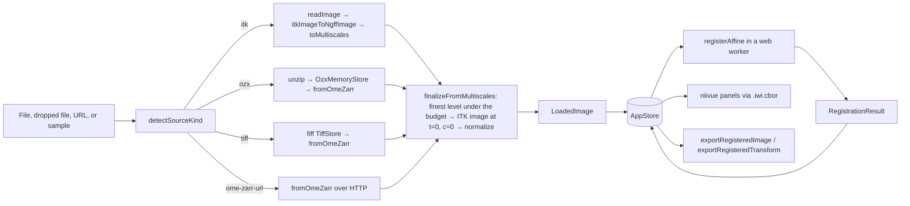
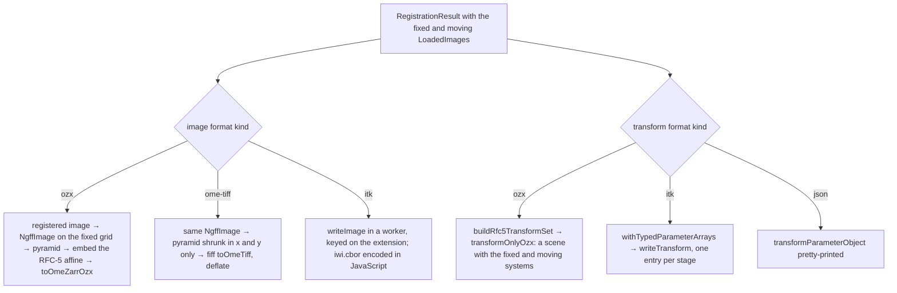

# Architecture overview

The demo is a Vite + TypeScript single-page application with no framework:
plain modules, [WebAwesome](https://webawesome.com/) custom elements for the
controls, and a small synchronous state store that everything renders from.
It does four things, each in its own set of modules, and this document walks
through them in the order a session meets them: **ingest** turns any input
into a scalar 2D or 3D ITK-Wasm image under a pixel budget, **registration**
runs elastix on the pair in a web worker, **rendering** shows the images in
two before/after comparisons drawn by four linked
[niivue](https://github.com/niivue/niivue) panels, and **export**
writes the registered image and the fixed-to-moving transform in the format
the user picks. The OME-Zarr transform conventions that the export section
depends on have their own note, [[ome-zarr-transform-output]].

## Module map

| Area          | Modules                                                                                                                                         |
| ------------- | ----------------------------------------------------------------------------------------------------------------------------------------------- |
| Bootstrap     | `src/main.ts`, `src/pipelines.ts`, `src/samples.ts`, `index.html`                                                                               |
| State         | `src/state.ts`                                                                                                                                  |
| Ingest        | `src/io/load-image.ts`, `source-kind.ts`, `scale-select.ts`, `normalize.ts`, `ozx-store.ts`, `tiff-store.ts`                                    |
| Registration  | `src/registration/register.ts`, `types.ts`, `abortable.ts`; `src/ui/register-flow.ts`, `reload-flow.ts`, `registration-panel.ts`               |
| Rendering     | `src/viewer/panel.ts`, `comparison-options.ts`, `promote-to-3d.ts`, `webgl.ts`; `src/ui/view-controls.ts`, `image-info.ts`; `src/io/iwi-cbor.ts` |
| Export        | `src/io/formats.ts`, `export-plan.ts`, `export-image.ts`, `export-transform.ts`, `export.ts`, `rfc5-transform.ts`, `transform-list.ts`, `download.ts`; `src/ui/download-flow.ts` |
| Shell and UX  | `src/ui/shell.ts`, `splash.ts`, `notify.ts`, `theme.ts`, `layout.ts`, and the `*-options.ts` module beside each                                 |

Two conventions run through the whole tree:

- **Decisions live apart from wiring.** Every module that touches the DOM or
  an ITK-Wasm pipeline package (which spawns a web worker on import) has a
  DOM-free sibling holding the logic: `scale-select.ts` beside
  `load-image.ts`, `export-plan.ts` beside `export-image.ts`,
  `registration/types.ts` beside `register.ts`, a `*-options.ts` beside each
  UI binding. The siblings import each other with explicit `.ts` specifiers
  and are what the `node:test` unit tests exercise; the wiring re-exports
  from them so the rest of the app has one import path. The flows
  (`register-flow.ts`, `reload-flow.ts`, `download-flow.ts`) take their
  runner, loader, and exporters as arguments for the same reason.
- **Everything renders from the store.** `src/state.ts` holds the inputs,
  the result, the options, the busy flags, the display toggles, and the
  chosen formats, and exposes named patches (`inputsLoaded`, `resultReady`,
  `formatChosen`, …) and selectors (`canRegister`, `movingPanelContent`,
  `resultPanelContent`, …). The shell, the panels, the controls, and the
  details subscribe and re-render on every update, so swapping the result
  comparison to the result or disabling a button during a run is a state
  change, not a call into a component. A listener that throws is reported through the
  notifier and the others still run.

## Ingest pipeline

`loadImageSource(source, { budgetBytes, onProgress, onWarning })` in
`src/io/load-image.ts` is the one entry point; the splash, the URL fields,
the drop zones, and the budget reload all go through it. It is a router with
a shared tail.

**Routing.** `detectSourceKind(name, url)` (`source-kind.ts`) looks only at
extensions: `.ozx` is a zipped store, a URL path ending in `.zarr` is a
directory store, `.tif`/`.tiff` (with or without `.ome`) is TIFF, and
everything else goes to ITK. Each kind has a head that produces an ngff-zarr
`Multiscales`:

- **`itk`:** the bytes are read (a `File` in one go; a URL streamed so the
  splash can show byte progress) and decoded with `@itk-wasm/image-io`'s
  `readImage` in a worker that is terminated afterwards. The ITK image
  becomes an `NgffImage` (`itkImageToNgffImage`, 128-voxel chunks, RFC-4
  anatomical orientation attached when the image is 3D and its format stores
  a direction matrix) and then a pyramid: `planScaleFactors`
  (`scale-select.ts`) adds isotropic factors 2, 4, 8, … only until the
  estimated level fits the budget, and `toMultiscales` builds those levels
  with `@itk-wasm/downsample`'s Gaussian method and uncompressed chunks. An
  empty factor list yields a single-level pyramid.
- **`ozx`:** the archive is unzipped whole into an `OzxMemoryStore`
  (`ozx-store.ts`), a `Map` of absolute keys to standalone buffers that also
  answers `getRange`, which zarrita needs for sharded arrays. The OME-Zarr
  version comes from the RFC-9 archive comment when present.
- **`tiff`:** the file or URL is opened as a fiff `TiffStore`
  (`tiff-store.ts`), which indexes the IFDs, SubIFD pyramids included, and
  synthesizes OME-Zarr 0.5 metadata over them, so the same reader handles
  it. Deflate tiles are decoded on a `WorkerPool` sized to the core count;
  a URL is read with HTTP range requests rather than downloaded.
- **`ome-zarr-url`:** `fromOmeZarr` over zarrita's fetch store, reading only
  the metadata documents at this point.

**The tail.** `finalizeFromMultiscales` is the same for all four:
`selectScaleForBudget` picks the finest level whose uncompressed size fits
the budget (else the coarsest); `ngffImageToItkImage` converts that level at
`t = 0`, `c = 0` so elastix always receives a scalar image; and
`normalizeForRegistration` (`normalize.ts`) squeezes a single-slice volume
to 2D, insists on a scalar 2D or 3D result, and measures the bytes elastix
will be handed. Because only the selected level is converted, a lazily
backed pyramid (a remote store, a TIFF) is never pulled whole. The result is
a `LoadedImage`: the full `multiscales`, the chosen `scaleIndex` and
`ngffImage`, the `itkImage` for elastix, the byte counts and channel and time
point extents for display, and the `source` it came from so it can be loaded
again under another budget.

**The pair.** The splash (`src/ui/splash.ts`) loads its two slots one at a
time (two concurrent ITK-Wasm reads of the same format deadlock), shows a
summary of what each slot holds, and runs `assertCompatiblePair` before
"Start" is enabled: both scalar, both the same dimension. The budget picker
in the registration panel goes through `reload-flow.ts`, which loads both
sources again at the new budget and commits the pair and the budget together.
Either way `src/main.ts` starts a registration once the new pair is on
screen; the splash closes without waiting for it.
`?budget=<MiB>` on the page URL sets the initial budget for tests.

## Registration flow

`registerAffine(fixed, moving, { numberOfResolutions, parameterObject?,
webWorker?, signal? }, onStatus)` in `src/registration/register.ts` is the
whole of the elastix integration:

1. One itk-wasm web worker is created for the run (or a caller-supplied one
   reused), so the UI thread never blocks.
2. `buildAffineParameterObject` calls `defaultParameterMap` for
   `translation`, `rigid`, and `affine`, in that order, each with the chosen
   `NumberOfResolutions` (default 3, picker range 2 to 5), and returns the
   three maps as one parameter object.
3. `elastix(parameterObject, { fixed, moving, webWorker })` runs the three
   stages. itk-wasm posts copies of the pixel buffers, so the inputs stay
   usable. The result is the moving image resampled onto the fixed image's
   grid, the fixed-to-moving transform as an itk-wasm `TransformList` (a
   `Composite` marker followed by one transform per stage: `Affine`,
   `Euler2D` or `Euler3D`, `Translation`, the last applied first), and the
   optimized `transformParameterObject`.
4. The worker is terminated. Aborting `signal` is how a run is cancelled:
   `abortable()` rejects the pending pipeline promise with the signal's
   reason and the worker is terminated at once, because elastix cannot be
   interrupted any other way. A bare number rejected by the wasm module (an
   uncaught C++ exception) is turned into a readable `Error`.

`src/ui/register-flow.ts` wraps that for a newly loaded pair, the Register
button, and the Cancel button: it marks the store as registering, ticks the status row every 100 ms with
the stage label and the elapsed time, and on success commits `resultReady`,
which stores the result and switches the result comparison to it. A result that
arrives after the inputs changed, or after a cancel, is discarded. The
registration panel (`registration-panel.ts`, decisions in
`registration-options.ts` and `registration-summary.ts`) renders the options
and, once a result exists, a summary card with the stages, the elapsed time,
the fixed-to-moving matrix and offset, and a copy button for the elastix
transform parameters as JSON.

## Rendering path

Every image reaches niivue the same way, in `src/viewer/panel.ts`: ITK-Wasm
`Image` → `.iwi.cbor` bytes → a `File` named `<name>.iwi.cbor` → niivue,
which decodes it with `@niivue/cbor-loader`'s `iwi2nii` (registered once
with `useLoader`). niivue's own OME-Zarr loader is deliberately unused; the
viewer always shows exactly the image elastix received or produced. Two
details of that path:

- The `.iwi.cbor` bytes are encoded in JavaScript (`src/io/iwi-cbor.ts`)
  rather than by `@itk-wasm/image-io`'s writer, whose CBOR tags mark
  multi-byte pixels as big-endian while the bytes are little-endian; niivue's
  decoder honours the tag and would byte-swap every voxel.
- A 2D image is promoted to a single-slice volume for display only
  (`promote-to-3d.ts`), because the loader reads a 3x3 direction. The
  registration and the exports always use the original 2D image; the
  inverse squeeze in `normalize.ts` handles the opposite direction on
  ingest.

The viewers are two WebAwesome `wa-comparison`s side by side, each a
draggable divider between two images that share one frame (the shell keeps
the two dividers at the same position): the inputs comparison on the left
holds the fixed image against the moving image, the result comparison on
the right the fixed image against the registered result once a run has
finished and the result switch is on, the moving image otherwise. Each side of each comparison is a `ViewerPanel`
(`src/viewer/panel.ts`), so there are four, named `<comparison>-<side>` in
`src/viewer/comparison-options.ts`, which also decides what each shows
(`panelContent`, a selector over the state), its caption, and which
`wa-comparison` slot a side takes: the component draws its `after` slot on
the left of the divider, so the fixed side takes that slot. A panel owns one
canvas and one `NiiVue` instance, keeps the view choices made for it (the
slice layout for 3D content, the colormap) and re-applies them whenever its
volume is replaced, and runs every volume change on its own queue so the
shell and the controls need not order their calls. All four are linked with
niivue's broadcast API: on every redraw the source copies its crosshair
(through world millimetres, so different grids agree), 2D pan and zoom, 3D
camera, and clip planes onto the others, which redraw without broadcasting
back. A panel draws no crosshair over a 2D image
(`crosshairWidthForDimension` in `src/ui/view-options.ts`), where the lines
would only cover the picture. The view controls (`src/ui/view-controls.ts`) offer the slice layouts
for a 3D pair, a reset that also centres both dividers, and a colormap per
side (applied to that side of both comparisons); each panel watches its
container and resizes its drawing buffer when the split panel flips or is
dragged. `webgl.ts` probes for a WebGL2 context at start-up and the app
stops with a persistent message when there is none.

## Export paths

The two download buttons share one shape: a format picker filled from the
registry in `src/io/formats.ts` (id, label, extension, and the `kind` a
writer is dispatched on), `download-flow.ts` calling the exporter for the
chosen id with the state captured at the click, and `download.ts` saving the
bytes through a temporary anchor. The exporters return the bytes with the
file name they should get; the names (`registered.<ext>`,
`transform.<ext>`, `transform-parameters.json`) and every other decision are
in `export-plan.ts`.

**Registered image** (`export-image.ts`). The result is turned into an
`NgffImage` named `registered` that borrows the fixed input's axis units and
is tagged with anatomical orientation under the same rule ingest applied to
the fixed image. Its pyramid is built the way ingest builds one, with the
budget-driven factors capped at four levels; since the result lives on the
fixed image's registration grid, which was chosen to fit the budget, that is
a single full-resolution level in practice. The `ozx` writer attaches the
fixed-to-moving affine to the multiscales metadata (`embedInMultiscales`)
and hands the pyramid to ngff-zarr's 0.6 writer, reporting chunk progress.
The `ome-tiff` writer builds an XY-only pyramid for a volume (an OME-TIFF
cannot hold a z-downsampled level) and hands it to fiff's `toOmeTiff`, with
plane progress counted around the reads and deflate on a worker pool when
the page can use one. The `itk` writer is `@itk-wasm/image-io`'s
`writeImage` in its own worker (`export.ts`), except `iwi.cbor`, which the
JavaScript encoder handles for the reason given under rendering.

**Transform** (`export-transform.ts`). The `ozx` writer builds the RFC-5
transform set (`rfc5-transform.ts`): the two coordinate systems named
`fixed` and `moving`, each carrying the axis units and orientations of its
image over the axes the registration ran in, and the affine between them
converted by ngff-zarr's `itkTransformToNgffTransform` with both images as
frames so the change from ITK physical space to the intrinsic systems is
exact. Before ngff-zarr sees elastix's list, `transform-list.ts` drops the
`Composite` header, replaces the zero-count parameter fields itk-wasm leaves
as placeholder strings with empty typed arrays, and rewrites the Euler stage
as an equivalent `Affine`, since ngff-zarr decodes only matrix-storing
parameterizations. The standalone store is a single group whose `scene`
holds the systems and the affine, zipped as RFC-9. The same affine, with the
registered image's intrinsic system as its input, is what the image export
embeds. The `itk` writer gives `@itk-wasm/transform-io`'s `writeTransform`
the original list (typed arrays substituted), so an `.h5`, `.tfm`, `.mat`,
or `.iwt.cbor` holds one entry per stage as ITK wrote it; MINC XFM, which
holds one 3D linear transform, is refused before a writer is tried. The
`json` writer serializes the elastix `transformParameterObject`. The
direction of the transform, the choice of `affine` over simpler forms, the
`scene` placement, and the list clean-up are each argued in
[[ome-zarr-transform-output]].

## Cross-cutting concerns

- **Self-hosting.** `vite.config.ts` copies the pipeline modules of
  `@itk-wasm/elastix`, `image-io`, `transform-io`, and `downsample` into
  `dist/pipelines/`, and `src/pipelines.ts` points each package at
  `<base>/pipelines/` before any other module runs. The packages that spawn
  workers or load wasm relative to their own URL are excluded from Vite's
  dependency pre-bundling. Every URL derives from `import.meta.env.BASE_URL`,
  which is how the same build serves the GitHub Pages sub-path.
- **Errors and progress.** Every flow reports through the shell's
  `setStatus`; a success, warning, or danger status is also raised as a
  toast (`src/ui/notify.ts`), so the flows have no toast code of their own.
  Wasm exceptions that surface as bare numbers are normalised to messages
  in both the registration runner and the writers.
- **Theme and layout.** WebAwesome's dark palette is keyed on a root class;
  an inline script in `index.html` applies the pinned or system scheme before
  the first paint and `theme.ts` takes over. `layout.ts` flips the split
  panel to stacked below the one breakpoint that `style.css` shares.
- **Tests.** The DOM-free modules are covered by `node:test`; the app as a
  whole by Playwright specs that read the store, the niivue instances, the
  splash, and the notifier from `window.__demo` and find controls by their
  stable ids. Since a loaded pair registers on its own, a spec that looks at
  the app before the result holds the run by routing its pipeline fetch
  (`holdRegistration` in `test/helpers.ts`). The README describes how to run both and how the GitHub
  Actions workflows build, test, and deploy the app.
